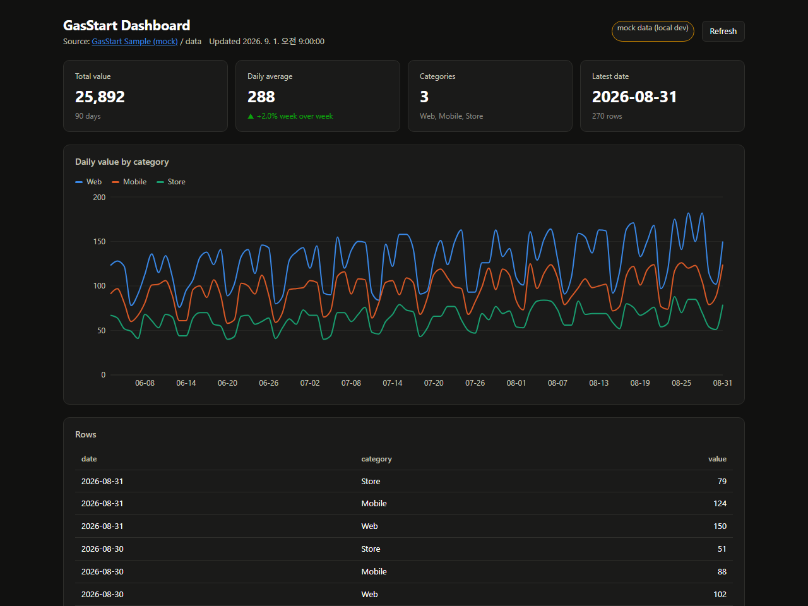
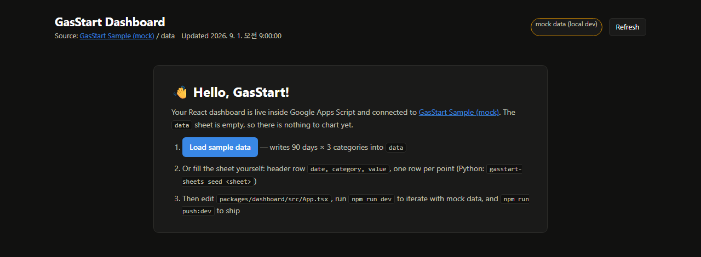

# GasStart

[](https://github.com/CatYulHa/gas-start/actions/workflows/ci.yml) [](./LICENSE)

**서버 없이 회사 대시보드를 띄우는 Google Apps Script 스타터.**

명령 하나로 Google 시트와 Apps Script 프로젝트를 만들고, React 대시보드를 웹앱으로 배포합니다.
인프라, 도메인, 서버 비용이 없습니다. 데이터는 회사 Google 계정 밖으로 나가지 않습니다.

[English README](./README.en.md) · [회사에서 쓰기](./docs/apps-script-guide.md) · [AI로 확장하기](./docs/ai-guide.md) · [보안](./SECURITY.md)



## 이런 분에게

- 엑셀이나 시트 안에서 만든 대시보드가 **유지보수와 커스텀에 한계**에 부딪혀, 코드로 만든 대시보드를 **링크 하나로** 공유하고 싶은 분
- 그렇다고 외부 호스팅에 회사 데이터를 올리기는 꺼려지는 분
- 보는 사람을 **회사 도메인 전체** 또는 **시트를 공유한 사람만**으로 제한할 수 있으면 충분한 분
- 스프레드시트를 데이터 소스로 쓰되, 화면은 React로 제대로 만들고 싶은 분
- Apps Script를 로컬에서 TypeScript로 개발하고 Git으로 관리하고 싶은 분

## 어떻게 동작하나

```
Python ETL ──write──▶  Google Sheets  ◀──read──  Apps Script (TS → JS 번들)  ──▶  React 대시보드
(선택)                 `data` 탭                  getDashboardData()             KPI · 차트 · 표
```

- **Apps Script**가 백엔드입니다. Google 서버에서 실행되며 시트를 읽어 JSON으로 돌려줍니다.
- 백엔드 소스는 **TypeScript**로 씁니다. Apps Script는 JavaScript(`.gs`)만 실행하므로, Vite가 TypeScript를 JavaScript 파일 하나(`Code.js`)로 컴파일하고 `clasp`이 올립니다. 편집기에는 `Code.gs`로 보입니다. clasp 3부터 clasp 자체의 TypeScript 변환은 없어졌기 때문에 이 빌드 단계가 스타터에 들어 있습니다.
- **React 대시보드**는 단일 HTML 파일로 번들되어 Apps Script가 그대로 서빙합니다.
- **Python**은 선택입니다. 외부 데이터를 가공해 시트에 넣을 때만 씁니다.
- `clasp`로 dev와 prod를 따로 배포합니다. 모든 명령은 `npm run …` 하나로 통일되어 있습니다.

## 시작하기

### 준비물

- **Node.js 20 이상**과 **git**. Windows, macOS, Linux 모두 같은 명령을 씁니다.
- **Google 계정** (개인 Gmail 또는 회사 Workspace)
- Python 3.11 이상 — 시트에 데이터를 넣는 Python 도구를 쓸 때만

> Windows PowerShell에서 `npm.ps1 파일을 로드할 수 없습니다`가 나오면 한 번만 실행하세요:
> `Set-ExecutionPolicy -Scope CurrentUser RemoteSigned`

### 명령 세 개

```bash
git clone https://github.com/CatYulHa/gas-start.git
cd gas-start
npm install
npm run setup
```

GitHub의 **Use this template** 버튼으로 내 저장소를 먼저 만들어도 됩니다. 설치는 pip이 아니라 git + npm입니다.

### `npm run setup`이 하는 일

| 단계 | 내용 |
|---|---|
| 1. Google 로그인 | 브라우저가 열립니다. 토큰은 `~/.clasprc.json`에 저장되어 다음부터 묻지 않습니다. |
| 2. Apps Script API 확인 | 계정에서 API가 꺼져 있으면(기본값) 설정 페이지를 열어 줍니다. 켜고 Enter를 누르면 이어갑니다. |
| 3. 프로젝트 생성 | **새 스프레드시트**와 거기에 연결된 **Apps Script**를 만듭니다. 시트 ID를 설정할 필요가 없습니다. |
| 4. 빌드 | React → `dist/index.html`, TypeScript → `dist/Code.js` |
| 5. 업로드 | `clasp push` |
| 6. 배포 | 웹앱 URL을 만듭니다. 다음 배포부터는 같은 URL을 갱신합니다. |
| 7. 열기 | 웹앱을 브라우저로 열고, 편집기와 시트 링크를 출력합니다. |

### 첫 화면



1. Google이 권한 승인을 한 번 묻습니다. "확인되지 않은 앱" 경고가 함께 나오는데, 심사받지 않은 개인 앱에 붙는 기본 경고입니다. **고급 → (안전하지 않음)으로 이동 → 허용**으로 지나가면 됩니다. 배포한 본인만, 한 번만 봅니다.
2. **Load sample data**를 누르면 `data` 시트에 90일치 샘플이 들어가고 KPI, 차트, 표가 나타납니다.

여기까지 되면 끝입니다. 이제 `packages/dashboard/src/App.tsx`와 `packages/gas/src/main.ts`를 고쳐 나가면 됩니다.

> 이미 만든 Apps Script가 있다면 `packages/gas/.clasp.example.json`을 `.clasp.dev.json`으로 복사해 `scriptId`를 넣고 `npm run setup`을 실행하세요. 생성 단계만 건너뜁니다.

## 매일 쓰는 명령

```bash
npm run dev          # 로컬에서 UI 개발. mock 데이터 사용, 배포 불필요 (http://localhost:5173)
npm run push:dev     # 빌드 + 업로드. 편집기의 "테스트 배포" URL(/dev)에 바로 반영
npm run deploy:dev   # 웹앱 URL(/exec)에 새 버전 게시
npm run ship:dev     # push + deploy 한 번에
npm run check        # typecheck + build. CI와 같은 검사
```

| 열기 | 명령 |
|---|---|
| 웹앱 | `npm run web:dev` |
| Apps Script 편집기 (로그, 트리거) | `npm run open:dev` |
| 연결된 스프레드시트 | `npm run sheet:dev` |

`npm run dev`에서 `http://localhost:5173/?empty`를 열면 데이터가 없을 때의 환영 화면을 볼 수 있습니다.

## 코드는 어디에 있나

편집은 항상 **로컬 소스**에서 합니다. 빌드 결과 3개 파일만 Google에 올라갑니다.

| | 소스 (여기서 편집) | 빌드 결과 | Apps Script 편집기에 보이는 이름 |
|---|---|---|---|
| 백엔드 | `packages/gas/src/*.ts` (TypeScript) | `packages/gas/dist/Code.js` | `Code.gs` — Google 서버에서 실행 |
| 대시보드 | `packages/dashboard/src/*.tsx` (React) | `packages/gas/dist/index.html` — JS와 CSS가 모두 인라인된 한 파일 | `index.html` — `doGet()`이 브라우저로 서빙 |
| 매니페스트 | `packages/gas/appsscript.json` | 복사 | `appsscript.json` — 권한 스코프, 웹앱 공개 범위 |
| 공용 타입 | `packages/shared/src/index.ts` | 양쪽 번들에 포함 | — |

자주 묻는 것:

- **온라인 편집기에서 고쳐도 되나요?** 아니요. 다음 `push`가 덮어씁니다. 편집기는 실행 로그, 트리거, 스크립트 속성을 볼 때만 씁니다.
- **Apps Script에 TypeScript를 그대로 올릴 수 있나요?** 아니요. Apps Script는 JavaScript만 실행합니다. 예전에는 `clasp push`가 TypeScript를 변환해 줬지만 clasp 3부터 빠졌습니다. 그래서 `npm run build`가 TypeScript를 `dist/Code.js`로 컴파일하고, 그 파일이 올라가 편집기에서 `Code.gs`로 보입니다. 타입 검사와 자동완성은 로컬에서만 하고, Google에는 결과 JavaScript만 갑니다.
- **소스가 Google에 올라가나요?** 아니요. TypeScript와 React 소스는 이 저장소에만 있습니다.
- **`dist/`를 커밋하나요?** 아니요. `.gitignore`에 있고 `npm run build`로 다시 만듭니다.
- **데이터는 어디 있나요?** `npm run setup`이 만든 스프레드시트의 `data` 탭입니다. `npm run sheet:dev`로 엽니다.

## 프로젝트 구조

```
gas-start/
├─ AGENTS.md                  AI 코딩 도구용 규칙 (CLAUDE.md 등은 이 파일을 가리킴)
├─ docs/                      apps-script-guide.md · deploy.md · ai-guide.md · images/
├─ scripts/
│  ├─ setup.mjs               npm run setup
│  └─ clasp.mjs               환경(dev/prod)을 바꿔 clasp를 실행하는 래퍼
├─ packages/
│  ├─ shared/src/index.ts     Row · DashboardData · ServerApi — 서버와 대시보드가 공유하는 타입
│  ├─ gas/                    Apps Script 백엔드 (TypeScript)
│  │  ├─ src/main.ts          doGet · getDashboardData · seedSampleData · ping · setup
│  │  ├─ src/sheets.ts        readTable / writeTable — 헤더 행을 키로 하는 객체 배열
│  │  ├─ src/config.ts        연결된 시트를 자동 인식. 독립 스크립트면 SPREADSHEET_ID 속성
│  │  └─ appsscript.json      스코프 · webapp { executeAs, access }
│  └─ dashboard/              React 19 + Vite 8 + Recharts
│     ├─ src/App.tsx          KPI 타일 · 라인 차트 · 표
│     ├─ src/components/      Welcome(빈 상태) · TrendChart · DataTable · KpiTile
│     └─ src/lib/gas.ts       runGas("함수명") — google.script.run의 Promise 래퍼. 로컬에선 mock으로 대체
└─ python/                    gasstart-sheets — pandas로 시트 읽기/쓰기 (선택)
```

## 확장하기

### 서버 함수 추가

대시보드에서 부를 수 있는 함수를 추가할 때는 세 곳을 함께 고칩니다.

1. `packages/gas/src/main.ts` — `export function myFn(...)` 작성
2. `packages/shared/src/index.ts` — `ServerApi`에 시그니처 추가
3. `packages/gas/vite.config.ts` — `globals` 배열에 이름 추가 (번들에서 제거되지 않도록)

그다음 대시보드에서 `await runGas("myFn", ...)`로 호출합니다. 이름, 인자, 반환 타입이 컴파일 시점에 검사됩니다.

`export`한 함수는 웹앱을 열 수 있는 사람이 누구나 호출할 수 있는 **공개 엔드포인트**입니다.
시트에 쓰는 함수에는 `seedSampleData`처럼 `assertDeployer()` 가드를 두세요.

### AI 코딩 도구와 함께

Codex, Cursor, Windsurf, Devin, Copilot, Claude Code 등 어떤 도구든 저장소를 열면 루트의 **`AGENTS.md`**를 읽고 위 규칙을 따릅니다.
"`region`별 매출 막대 차트 추가해 줘" 같은 프롬프트 레시피는 [docs/ai-guide.md](./docs/ai-guide.md)에 있습니다.

### Python으로 시트에 데이터 넣기

외부 API나 CSV를 pandas로 가공해 시트에 적재하는 도구입니다. 인증은 옛 Google 퀵스타트의 `token.pickle` 방식과 같습니다.
첫 실행에만 브라우저에서 Google 로그인을 하고, 이후에는 저장된 토큰을 재사용합니다. Google Cloud 프로젝트나 `credentials.json`은 필요 없습니다([pydata-google-auth](https://pydata-google-auth.readthedocs.io/)의 내장 OAuth 클라이언트를 씁니다). 로그인한 계정이 열 수 있는 시트라면 내 것이든 공유받은 것이든 바로 읽고 씁니다.

```bash
cd python
python -m venv .venv
.venv\Scripts\activate          # Windows PowerShell
source .venv/bin/activate      # macOS / Linux
pip install -e ".[dev]"

gasstart-sheets auth                              # 첫 실행: 브라우저 로그인 → 토큰 저장(%APPDATA%\gasstart)
gasstart-sheets seed  <SHEET_ID_or_URL>           # 샘플 데이터 → data 탭
gasstart-sheets read  <SHEET_ID_or_URL> data -o out.csv
gasstart-sheets write out.csv <SHEET_ID_or_URL> data
```

```python
from gasstart_sheets import get_client, read_df, write_df

gc = get_client()
df = read_df(gc, "<SHEET_ID>", "data")
write_df(gc, "<SHEET_ID>", "summary", df.groupby("category", as_index=False)["value"].sum())
```

회사 정책상 자체 OAuth 클라이언트를 써야 할 때(`.secrets/credentials.json`), 환경변수, 서비스 계정 사용법은 [python/README.md](./python/README.md)에 있습니다.

## 회사에서 쓰기 — 누가 볼 수 있나

공개 범위는 `packages/gas/appsscript.json`의 `webapp` 블록 두 줄로 정합니다. 바꾼 뒤 `npm run ship:dev`(또는 `ship:prod`)로 다시 게시하면 적용됩니다. 세 가지 중 하나를 고르면 됩니다.

| 단계 | 누가 보나 | `webapp` 설정 | 시트 공유 | 방문자 승인 화면 |
|---|---|---|---|---|
| 1. 배포자만 (기본) | 배포한 본인 | `"executeAs": "USER_DEPLOYING", "access": "MYSELF"` | 불필요 | 본인 1회 |
| 2. 회사 도메인 전체 | 같은 Google Workspace 조직의 모든 계정 | `"executeAs": "USER_DEPLOYING", "access": "DOMAIN"` | 불필요 | 없음 |
| 3. 시트를 공유한 사람만 | 시트에 뷰어 이상으로 공유된 계정 | `"executeAs": "USER_ACCESSING", "access": "ANYONE"` | 필요 (보여 줄 사람에게 뷰어로) | 각자 1회 |

**1단계**는 처음 `npm run setup`을 했을 때의 상태입니다. URL을 남에게 줘도 열리지 않으니 개발 중에 안전합니다.

**2단계**는 사내 공용 대시보드에 맞습니다. 스크립트가 배포자 권한으로 시트를 읽기 때문에 시트를 따로 공유하지 않아도 되고, 방문자는 승인 화면 없이 링크만 열면 됩니다. 회사 Workspace 계정으로 배포했을 때만 고를 수 있고, 다른 도메인 사용자는 앱 코드가 실행되기 전에 Google이 막습니다.

```json
"webapp": { "executeAs": "USER_DEPLOYING", "access": "DOMAIN" }
```

**3단계**는 "이 시트를 볼 수 있는 사람이 대시보드도 볼 수 있다"는 규칙입니다. 스크립트가 방문자 본인 권한으로 실행되므로, 시트를 공유받지 못한 사람은 링크를 열어도 데이터를 읽지 못합니다. 누가 보는지를 시트의 공유 목록으로 관리하고 싶을 때, 부서 몇 명이나 외부 파트너에게만 열고 싶을 때, 그리고 개인 Gmail 계정이라 `DOMAIN`을 쓸 수 없을 때 이 방식을 씁니다. 방문자마다 첫 방문에 승인 화면이 한 번 나오며, 개인 계정에는 "확인되지 않은 앱" 경고가 함께 뜰 수 있습니다(대응은 [docs/deploy.md §6](./docs/deploy.md)). Workspace 조직 안에서만 쓰려면 `access`를 `DOMAIN`으로 두고 `executeAs`만 바꿔도 됩니다.

```json
"webapp": { "executeAs": "USER_ACCESSING", "access": "ANYONE" }
```

```bash
npm run ship:dev
```

- 시트에 **쓰는** 함수(`seedSampleData` 등)는 어떤 단계에서도 배포한 계정(시트 소유자)만 실행할 수 있습니다. 3단계에서 뷰어에게는 "Load sample data" 버튼이 권한 오류로 끝나는 것이 정상입니다.
- 특정 부서만 허용, 사용자별로 다른 데이터, 관리자 정책, 할당량과 한계는 [docs/apps-script-guide.md](./docs/apps-script-guide.md)에 정리했습니다.

### dev와 prod

dev와 prod는 완전히 별개의 스크립트, 시트, URL입니다. 같은 소스를 다른 `scriptId`로 올릴 뿐입니다.

```bash
npm run setup:prod     # prod용 시트 + 스크립트 + 배포를 한 번에 만듭니다
npm run ship:prod      # 이후 게시. URL은 고정됩니다
```

환경 정보는 `packages/gas/.clasp.dev.json`, `.clasp.prod.json`에 들어 있고 커밋되지 않습니다.
`staging`이 필요하면 `npm run setup -- --env staging`으로 하나 더 만들 수 있습니다.
무엇이 어디에 생기는지, 다른 PC에서 이어 쓰기, 삭제 방법은 [docs/deploy.md](./docs/deploy.md)에 있습니다.

## 보안

- **공개 범위** — 기본은 배포자만(`MYSELF`). 회사 도메인 전체(`DOMAIN`)나 시트를 공유한 사람만(`USER_ACCESSING`)으로 넓히는 것은 위 "회사에서 쓰기"처럼 의도적으로 합니다.
- **권한 스코프** — `spreadsheets.currentonly`(연결된 시트 하나만) + `userinfo.email`로 최소화. 다른 시트를 `openById`로 열거나 `UrlFetchApp`을 쓰면 스코프를 추가합니다.
- **쓰기 가드** — 시트를 바꾸는 서버 함수는 `assertDeployer()`로 배포한 계정(시트 소유자)만 실행하게 되어 있습니다. 세 가지 공개 범위 모두에서 동작합니다.
- **비밀 파일** — `.clasp.*.json`(스크립트 ID), `.secrets/`(OAuth 클라이언트, 토큰)는 `.gitignore`에 있습니다. 저장소에는 어떤 자격증명도 들어 있지 않습니다.
- **Python 쓰기** — `=`, `+`, `-`, `@`로 시작하는 문자열은 수식이 아닌 텍스트로 저장합니다(수식 주입 방지). 필요하면 `--allow-formulas`.

취약점 신고와 자세한 설명은 [SECURITY.md](./SECURITY.md)에 있습니다.

## 명령 전체 목록

`<env>`는 `dev` 또는 `prod`입니다.

| 명령 | 동작 |
|---|---|
| `npm run setup` / `setup:prod` | 로그인 → API 확인 → 생성 → 빌드 → push → 배포 → 열기 |
| `npm run dev` | 로컬 개발 서버 (mock 데이터) |
| `npm run check` | typecheck + build |
| `npm run push:<env>` | 빌드 후 `clasp push -f` |
| `npm run deploy:<env>` | 배포 생성 또는 갱신 (URL 유지) |
| `npm run ship:<env>` | push + deploy |
| `npm run web:<env>` / `open:<env>` / `sheet:<env>` | 웹앱 / 편집기 / 시트 열기 |
| `npm run create:<env>` | 스크립트만 새로 생성 (`-- --type standalone` 가능) |
| `npm run status:dev` / `deployments:prod` | 업로드될 파일 / 배포 목록 |
| `npm run clasp -- <env> <clasp 명령>` | 그 외 clasp 명령 그대로 전달 |

`npm run setup` 옵션: `--env <이름>`, `--type standalone`, `--title "이름"`, `--no-open`, `--dry-run`

## 문제 해결

| 증상 | 해결 |
|---|---|
| PowerShell: `npm.ps1 파일을 로드할 수 없습니다` | `Set-ExecutionPolicy -Scope CurrentUser RemoteSigned` 한 번 실행. 관리자 권한 불필요 |
| `User has not enabled the Apps Script API` | `npm run setup`이 설정 페이지를 열어 줍니다. 켠 뒤 1~2분 후 다시 실행 |
| "Google에서 확인하지 않은 앱" 경고 | 정상입니다. 배포자만 한 번 **고급 → 이동 → 허용**. [자세히](./docs/deploy.md) |
| "Authorization required" | 첫 방문 시 정상. 배포한 계정으로 열고 권한 검토 → 허용 |
| 스코프를 바꿨는데 권한 오류 | `oauthScopes`를 바꾸면 push 후 웹앱을 다시 열어 재승인 |
| `Script function not found: …` | 함수가 `vite.config.ts`의 `globals`에 없거나 push되지 않음 → `npm run push:dev` |
| 배포했는데 변경이 안 보임 | `push`는 `/dev`에만 반영됩니다. `/exec`는 `deploy` 후 갱신 |
| "No spreadsheet configured" | 독립(standalone) 스크립트일 때만. 스크립트 속성 `SPREADSHEET_ID` 설정 |
| `Missing packages/gas/.clasp.dev.json` | `npm run setup` 또는 `.clasp.example.json` 복사 후 `scriptId` 입력 |
| `Project file already exists` | `packages/gas/.clasp.json`을 삭제하고 다시 실행 |
| clasp 명령이 문서와 다름 | clasp 3부터 `create-script`, `create-deployment` 등으로 바뀌었습니다. `npx clasp --help` |
| Python 첫 실행에 "확인되지 않은 앱" 경고 | 공용 OAuth 클라이언트에 붙는 기본 경고. 고급 → 이동 → 허용. 다시 로그인하려면 `gasstart-sheets auth --reset` |
| Python 403 / `PERMISSION_DENIED` | 로그인한 Google 계정에 그 시트 권한이 있는지 확인(다른 계정으로 로그인했다면 `auth --reset`). 자체 OAuth 클라이언트를 쓰는 경우 동의 화면 테스트 사용자·Sheets/Drive API 활성화 |

## 더 읽기

| 문서 | 내용 |
|---|---|
| [docs/apps-script-guide.md](./docs/apps-script-guide.md) | Apps Script를 서버리스 플랫폼으로 이해하기. `executeAs × access`, 도메인 제한, 사용자별 데이터, 관리자 정책, 할당량 |
| [docs/deploy.md](./docs/deploy.md) | `setup`이 만드는 것, `/dev`와 `/exec`, dev → prod, 다른 PC에서 이어 쓰기, 삭제 |
| [docs/ai-guide.md](./docs/ai-guide.md) | AI 코딩 도구로 대시보드 확장하기. 프롬프트 레시피 |
| [python/README.md](./python/README.md) | Python 패키지: 로그인 방식 세 가지(기본 / 자체 OAuth 클라이언트 / 서비스 계정), 환경변수 |
| [SECURITY.md](./SECURITY.md) | 보안 기본값과 취약점 신고 |
| [CONTRIBUTING.md](./CONTRIBUTING.md) | 기여 방법 |

## 라이선스

MIT. 도움이 되었다면 ⭐를 눌러 주세요 — 다른 사람이 찾는 데 도움이 됩니다.

GasStart는 개인 프로젝트이며 Google LLC와 무관합니다. Google Apps Script, Google Sheets는 Google LLC의 상표입니다.
